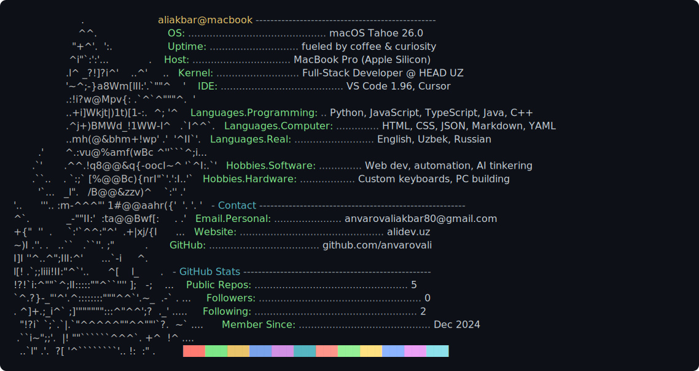

<!--
  GitHub profile README for anvarovali. Card is profile.svg (renders colors
  everywhere). Portrait uses a small font so it resolves into a face at page size;
  the neofetch panel uses a larger font so it stays readable. Keep profile.svg here.
-->

<h2 align="center">Hi, I'm Aliakbar 👋</h2>

<i>50% coding, 50% fixing what worked yesterday.</i>

  

  <a href="https://alidev.uz">Website</a> &nbsp;·&nbsp;
  <a href="mailto:anvarovaliakbar80@gmail.com">Email</a> &nbsp;·&nbsp;
  <a href="https://github.com/anvarovali">GitHub</a>

  
📄 Prefer it static? Click to expand the readable card

  

    
  

